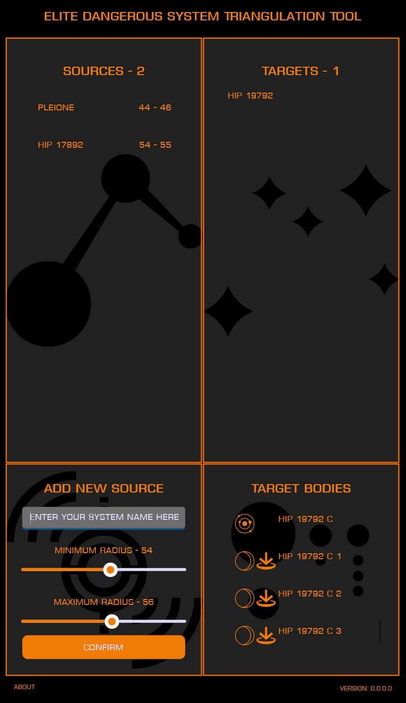

# Elite Dangerous Triangulation Tool

| Windows | Android |
|:-:|:-:|
|  |  |

## What Is This?

Welcome CMDR! This little tool is designed to solve triangulation puzzles in Elite Dangerous, such as those found in Listening Posts.

  

To use it, simply put in the name of a system and the distance around it in which to look for systems. This will populate a list of target systems that match that criteria.

As you add more and more systems to the sources list, the list of target systems will be limited to those that match all the source criteria at the same time, restricting the list of systems.

When you have narrowed the list of targets down enough, you can select a target system to see a list of bodies in the system.

## Contributing

Contributions are more than welcome. Please read the [Contribution Guidelines](CONTRIBUTING.md) for instructions on raising a PR.

## Dependencies and Credits

This app is entirely a third-party, open-source, fan project and is in no way affiliated with Frontier Developments or Elite: Dangerous itself.

All system data is pulled from the APIs made available by the fine folks over at [EDSM](https://www.edsm.net/).

All images and colour schemes are based on the wonderful fan creations at [EDAssets](https://edassets.org/#/).

This app is built in .NET 6.0 and the UI is using the .NET MAUI multi-platform UI framework.

Google Play and the Google Play logo are trademarks of Google LLC. Microsoft and the Microsoft logo are trademarks of Microsoft LLC.

## Bug Reports

Use the Issues tab above to raise issues and feature requests.

### [License](LICENSE.md)

### [Privacy Policy](PRIVACY.md)

### [Changelog](CHANGELOG.md)
